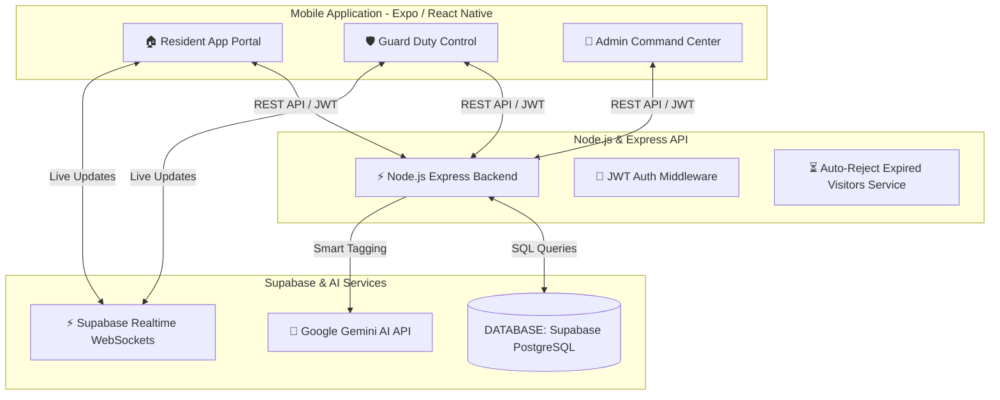

# 🏰 Gately — Smart Connected Living & Gate Security Platform

> **AI-Powered, Real-Time Society Management & Visitor Security System for Modern Communities.**

[](https://reactnative.dev/)
[](https://www.typescriptlang.org/)
[](https://supabase.com/)
[](https://expressjs.com/)
[](https://ai.google.dev/)

---

## 📌 Project Overview

**Gately** is a next-generation society management platform that bridges **Residents**, **Security Guards**, and **Society Admins** into a unified, high-speed real-time ecosystem.

It replaces slow paper registers, unverified visitor entries, and manual phone verifications with **1-Tap Pre-Approved QR Passes**, **Instant Gate Verification**, **AI-Powered Complaint Routing**, **Smart Amenity Slot Bookings**, and **Emergency SOS Broadcasts**.

---

## 🚀 Key Problems & Gately Solutions

| Traditional Gate Security ❌ | Gately Smart Solution ⚡ |
| :--- | :--- |
| Paper registers at gates cause long queues & security gaps | **1-Tap Pre-Approval QR Passes** for instant zero-wait gate entries |
| Slow intercom calls to residents for visitor approval | **Real-time Push & In-App Approvals** via Supabase WebSockets |
| Manual complaint handling with slow resolution times | **AI-Powered Complaint Categorization** & Auto-Routing using Gemini AI |
| No tracking of resident vehicles or delivery passes | **Instant License Plate & QR Scanner** for Guards |
| No centralized emergency communication system | **1-Tap Gate SOS Siren Broadcast** to all society residents |

---

## ✨ Features by Role

### 🏠 1. Resident Portal
- **⚡ Pre-Approve Visitors & Guests**: Generate digital QR passes with custom validity for family, delivery, or cabs.
- **🤖 AI-Powered Complaints**: File issues with photo attachments — Google Gemini AI auto-tags urgency and assigns technicians.
- **🏊 Smart Amenity Bookings**: Real-time slot reservations for Swimming Pool, Badminton Court, Gym, and Clubhouse.
- **🗳️ Society Polls & Notices**: Vote on community proposals and read official society broadcasts.

### 🛡️ 2. Guard Duty Control Center
- **📷 High-Speed QR Scanner**: Point-and-scan verification for guest passes with instant Entry/Exit status toggles.
- **📋 Pending Approvals Dashboard**: Filter and process incoming guest requests (Visitors, Vehicles, Deliveries) with 1-tap Approve/Reject.
- **🔍 Resident Directory Search**: Instant search by Name, Flat No, or Phone to verify resident details at the gate.
- **🚨 Emergency SOS Siren**: Broadcast gate security alarms to all residents and society admins instantly.

### 👑 3. Admin Command Center
- **📊 Real-Time Society Analytics**: Track active guards, daily visitor counts, open complaints, and CCTV camera statuses.
- **🛡️ Guard Roster Management**: Onboard and manage guard shift rosters, gate posts, and duty check-ins.
- **📑 Export Audit Reports**: Download weekly and monthly entry/exit logs for society compliance.

---

## 📐 System Architecture



---

## 🛠️ Tech Stack

- **Mobile Application**: React Native (Expo SDK 55), Expo Router v5, NativeWind / TailwindCSS v4, Lucide Icons, React Native Reanimated v3.
- **Backend API**: Node.js, Express.js, TypeScript, Axios, Node-Cron.
- **Database & Cloud**: Supabase (PostgreSQL, Row Level Security, Realtime WebSockets), Supabase Auth.
- **AI Integration**: Google Gemini API (Automated Complaint Tagging & Priority Routing).

---

## 📂 Project Structure

```text
hakMobile/
├── portl-app/                  # Mobile Application (Expo / React Native)
│   ├── app/
│   │   ├── (auth)/             # Login, Register & Onboarding Screens
│   │   ├── (resident)/         # Resident App Screens & Bottom Tabs
│   │   ├── (guard)/            # Guard Duty Screens & Scanner
│   │   └── (admin)/            # Admin Command Dashboard & Management
│   ├── assets/                 # App Logos, Icons & Splash Screen Assets
│   └── services/               # API Client & Supabase Initialization
│
├── portl-backend/              # Express API Server & Database Migrations
│   ├── src/
│   │   ├── routes/             # API Endpoints (Visitors, Passes, Polls, Complaints)
│   │   ├── middleware/         # Auth & Service Role JWT Verification
│   │   └── services/           # Supabase Admin & Gemini AI Services
│   ├── supabase/
│   │   └── full_setup.sql      # Complete 1-Click Database Setup Script
│   ├── seed-demo-users.js      # Demo Accounts Seeder
│   └── run-migration.js        # Automated CLI Migration Runner
```

---

## ⚡ Quick Start & Setup Guide

### 1. Prerequisites
- Node.js (v18 or higher)
- Expo Go App installed on mobile device (or Android Studio / iOS Simulator)
- A Supabase account ([supabase.com](https://supabase.com))

---

### 2. Database Setup (1-Click Supabase Migration)

1. Open your **[Supabase Dashboard](https://supabase.com/dashboard)** and select your project.
2. Go to **SQL Editor** -> **New Query**.
3. Copy & paste the contents of `portl-backend/supabase/full_setup.sql` and click **Run** (▶).

---

### 3. Backend Setup

```bash
# 1. Navigate to backend directory
cd portl-backend

# 2. Install dependencies
npm install

# 3. Configure environment variables (.env)
# Set your SUPABASE_URL, SUPABASE_SERVICE_ROLE_KEY, and DATABASE_URL

# 4. Push migrations & seed demo accounts
npm run db:push

# 5. Start backend server
npm run dev
```

Server will run on `http://localhost:3000`.

---

### 4. Mobile App Setup

```bash
# 1. Navigate to app directory
cd portl-app

# 2. Install dependencies
npm install

# 3. Start Metro Bundler
npx expo start --clear
```

Scan the QR code with **Expo Go** on your Android/iOS device to launch **Gately**!

---

## 🔑 Demo Test Credentials

Use these 1-Tap demo logins on the Login screen:

| Role | Email | Password | Access Level |
| :--- | :--- | :--- | :--- |
| **🏠 Resident** | `resident@gately.com` | `pass123` | Full Resident Portal, QR Passes, Amenities |
| **🛡️ Security Guard** | `guard@gately.com` | `pass123` | Gate Scanner, Resident Directory, SOS Siren |
| **👑 Admin** | `admin@gately.com` | `pass123` | Society Analytics, Guard Rosters, Reports |

---

## 🏆 Hackathon Highlights

- ⚡ **Zero-Delay Gate Approvals**: Under 1-second QR pass verification at main gate.
- 🎨 **State-of-the-Art Design**: Curated Glassmorphism theme with fluid micro-animations.
- 🤖 **Real AI Integration**: Practical Google Gemini AI application for complaint routing.
- 🔄 **Full End-to-End Functionality**: Complete production-ready backend, DB schema, and mobile views.

---

### 💚 Built for Hackathon Excellence by Team Gately
